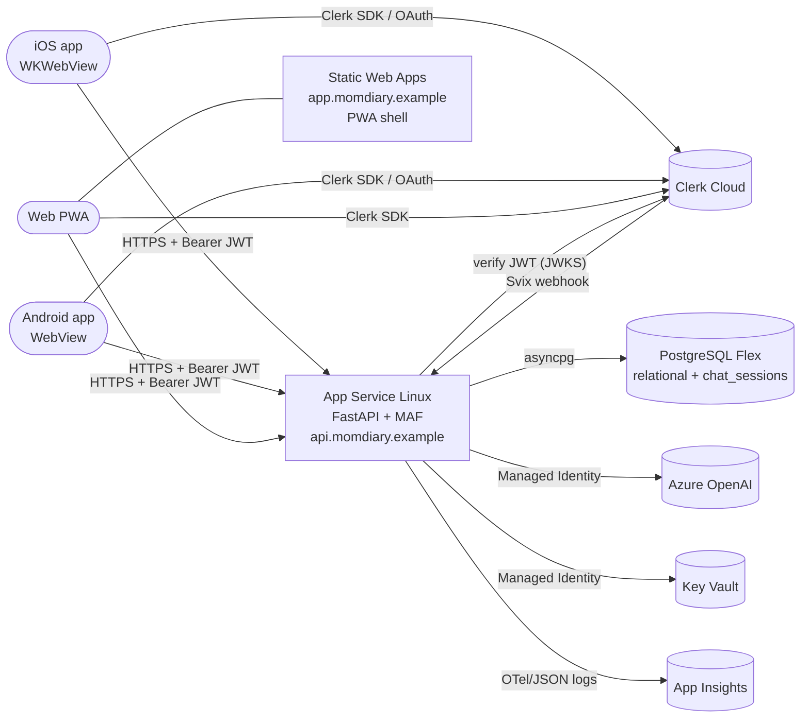

# MomDiary — iOS + Android (Capacitor) and Backend on Azure App Service

Status: draft v1 · Date: 2026-06-06 · Owner: platform/devops

End-to-end plan to ship MomDiary as **native iOS and Android apps** without
rewriting the React frontend, with the FastAPI backend running on **Azure
App Service for Linux**. Complements [Deployment.md](../Deployment.md)
(which already targets App Service); this document fills in the gaps
specific to mobile.

---

## 1. Goals & non-goals

**Goals**
- Single React/TypeScript codebase serves Web + iOS + Android.
- Native iOS (App Store) and Android (Google Play) packages with native
  splash, status bar, push, deep links, biometrics-gated app lock, and
  reliable speech-to-text on both platforms.
- Backend deployed to **Azure App Service Linux** with custom domain,
  Managed Identity to Azure OpenAI + Key Vault, and Postgres Flex
  (per [Deployment.md §1](../Deployment.md)).
- Reproducible CI/CD: GitHub Actions builds backend (zip-deploy to App
  Service), iOS (`.ipa` to TestFlight), and Android (`.aab` to Internal
  Track) on every tag.
- Auth continues via **Clerk** with native deep-link callback support.

**Non-goals**
- No React Native rewrite. (Considered and rejected in §3.)
- No App Service Premium plan in dev/staging (B1 is fine until prod).
- No offline-first sync in v1 (online-only; cached query results only).
- No Apple/Google Pay, no in-app subscriptions in v1.

---

## 2. Inventory of what the mobile build inherits

| Frontend asset (today)                                | Mobile impact                                                    |
| ----------------------------------------------------- | ---------------------------------------------------------------- |
| Vite 5 + React 18 + TS 5.4                            | Builds to static assets → bundled into native shell              |
| Tailwind 3.4                                          | Works as-is in WebView (no change)                               |
| TanStack Query v5                                     | Works as-is                                                      |
| `@clerk/clerk-react` web SDK                          | Works in WebView; needs deep-link config for OAuth callback      |
| `react-router-dom` v6                                 | Use `HashRouter` (or `MemoryRouter`) inside the app — see §5.3   |
| `localStorage` (chat mode, chat visibility)           | Works in WebView                                                 |
| `window.confirm` in delete handlers                   | Works but ugly; swap to `@capacitor/dialog` (§5.4)               |
| Browser-native `SpeechRecognition` in `ChatPanel.tsx` | **Broken on iOS WKWebView**; needs `@capacitor-community/speech-recognition` (§5.5) |
| `VITE_API_BASE_URL` env var                           | Points at App Service URL or custom domain (§6)                  |
| Voice mode tab                                        | Same as above — speech recognition gap                           |

---

## 3. Decision: Capacitor vs. React Native vs. PWA

| Option                      | Effort        | Reuses current code | App-store presence | Verdict          |
| --------------------------- | ------------- | ------------------- | ------------------ | ---------------- |
| **Capacitor 6** (Ionic Inc) | Days          | 100%                | Yes                | **Chosen**       |
| React Native (Expo)         | Weeks–months  | ~10% (logic only)   | Yes                | Rejected         |
| PWA only                    | <1 day        | 100%                | No                 | Add as fallback  |

Capacitor wraps the existing `dist/` Vite build into a native shell using
WKWebView (iOS) / WebView (Android), exposes native APIs via plugins,
and lets us keep one codebase. The PWA path is still worth keeping as a
fallback for users who can't install — done as a side-effect of §5.2.

---

## 4. Target architecture



Mobile apps are **first-class HTTPS clients of the same App Service** as
the web app. The web/PWA in SWA is still the canonical desktop
experience and the OAuth-callback landing page.

---

## 5. Phase-by-phase plan

Each phase has an **exit criterion**. Do not start the next phase until
the previous one's exit criterion is green.

### Phase 0 — Foundations (1 sprint, shared with web)

Things to do **inside the existing Vite app** before adding any native shell.
Each of these also benefits the current web build.

1. **Centralise base URL + auth headers** — confirm there is exactly one
   `apiBaseUrl()` helper (already in [`src/shared/apiClient.ts`](../frontend/src/shared/apiClient.ts))
   and that every fetch goes through it. Add a build-time guard that
   fails the build if `VITE_API_BASE_URL` is unset in prod mode.
2. **Pluggable storage** — wrap `localStorage` reads/writes in a tiny
   `kvStorage` module so we can swap in `@capacitor/preferences` on
   native without touching feature code.
3. **Pluggable confirm dialog** — wrap `window.confirm(...)` in a
   `confirm(message)` helper in `src/shared/dialogs.ts` and replace the
   5 call sites (`SleepItem`, `PoopItem`, `BabySwitcher`,
   `AppointmentItem`, `FeedItem`, `RemoveBabyDialog`).
4. **Pluggable speech recogniser** — extract `useSpeechRecognition` out
   of [`ChatPanel.tsx`](../frontend/src/features/chat/ChatPanel.tsx) into
   `src/shared/speech.ts` behind a `SpeechRecognizer` interface so we can
   swap implementations per platform.
5. **PWA manifest + icons** — add `vite-plugin-pwa`, generate
   `manifest.webmanifest` + 192/512/maskable icons, register a basic SW
   that does **network-first** for `/v1/*` and **stale-while-revalidate**
   for static assets. Same icon set is reused by Capacitor in §5.1.
6. **Strict CSP** — add a meta CSP that allows `https://api.momdiary…`,
   Clerk's JS origin, and `'self'`. Document the production allowlist
   for App Service to mirror via response headers.

**Exit:** `npm run build` produces `dist/` that installs as a PWA from a
desktop browser; all 5 confirm sites use the new helper; the speech
hook lives in `src/shared/speech.ts`.

---

### Phase 1 — Capacitor scaffold (1–2 days)

Add the native shells under a new top-level [`mobile/`](../mobile/) folder
so the Vite `frontend/` stays clean.

```text
mobile/
  capacitor.config.ts       # appId, appName, webDir = ../frontend/dist
  ios/                      # generated by `npx cap add ios`
  android/                  # generated by `npx cap add android`
  package.json              # owns @capacitor/* deps
```

Concrete steps:
1. `cd frontend && npm i -D @capacitor/core @capacitor/cli`.
2. `cd .. && mkdir mobile && cd mobile && npm init -y && npx cap init`
   - `appId`: `com.momdiary.app` (reserve in Apple + Google now).
   - `appName`: `MomDiary`.
   - `webDir`: `../frontend/dist`.
3. `npx cap add ios && npx cap add android`.
4. Add npm scripts in `frontend/package.json`:
   - `"build:mobile": "vite build --mode mobile"` (uses
     `.env.mobile` with `VITE_API_BASE_URL=https://api.momdiary.example`).
   - `"cap:sync": "npm run build:mobile && cd ../mobile && npx cap sync"`.
   - `"cap:ios": "npm run cap:sync && cd ../mobile && npx cap open ios"`.
   - `"cap:android": "npm run cap:sync && cd ../mobile && npx cap open android"`.
5. Set `server.androidScheme = "https"` in `capacitor.config.ts` so the
   WebView origin is `https://localhost`, which matches Clerk + cookies.
6. Generate splash + icons with `@capacitor/assets`
   (`npx capacitor-assets generate --iconBackgroundColor "#FFFAF5"` —
   pick the palette chosen from `frontend/mockups/palettes.html`).

**Exit:** `npm run cap:ios` opens Xcode and runs the app in the simulator;
`npm run cap:android` opens Android Studio and runs it in an emulator.
Both show the home screen and can submit a diary entry against
`api.momdiary.example`.

---

### Phase 2 — Native plugin integration (2–3 days)

Install only what's needed. Each row maps to a file change in `frontend/`.

| Capability       | Plugin                                            | Wire-up location                            |
| ---------------- | ------------------------------------------------- | ------------------------------------------- |
| Splash screen    | `@capacitor/splash-screen`                        | `main.tsx` — `SplashScreen.hide()` on ready |
| Status bar       | `@capacitor/status-bar`                           | `main.tsx` — set style + bg from palette    |
| Keyboard         | `@capacitor/keyboard`                             | `ChatPanel.tsx` — scroll composer into view |
| Network          | `@capacitor/network`                              | New `OfflineBanner` component               |
| Preferences (KV) | `@capacitor/preferences`                          | `src/shared/kvStorage.ts` native branch     |
| Native confirm   | `@capacitor/dialog`                               | `src/shared/dialogs.ts` native branch       |
| Speech-to-text   | `@capacitor-community/speech-recognition`         | `src/shared/speech.ts` native branch        |
| App URL open     | `@capacitor/app`                                  | Clerk OAuth deep-link handler (§5.3)        |
| Browser (OAuth)  | `@capacitor/browser`                              | Clerk redirect target                       |
| Push notifications (later)| `@capacitor/push-notifications` + APNs/FCM | Sleep/feed reminders (deferred to v1.1) |
| Haptics (later)  | `@capacitor/haptics`                              | Long-press confirmations                    |

Add a `Capacitor.getPlatform()` switch inside each `src/shared/*`
wrapper so the web branch keeps using the browser primitive. **No
feature code outside `src/shared/` should import `@capacitor/*`.**

**Exit:** Voice mode dictates a feed entry into the chat composer on a
real iPhone + real Pixel. Tapping the system back button on Android
closes a modal (not the app).

---

### Phase 3 — Auth deep-links (1–2 days)

Clerk's web SDK works in WebView but its email-magic-link, OAuth
(Google/Apple), and password-reset flows redirect to a URL that must
return into the app. Two pieces are needed:

1. **Capacitor URL scheme + Universal/App Links**
   - iOS: configure `CFBundleURLSchemes = ["momdiary"]` and an
     associated domain `applinks:app.momdiary.example` (host an
     `apple-app-site-association` JSON at the SWA root).
   - Android: declare `<intent-filter>` for
     `https://app.momdiary.example` and ship an
     `assetlinks.json` at the SWA root.
2. **Clerk app config**
   - In Clerk Dashboard, add `momdiary://oauth-callback` and
     `https://app.momdiary.example/oauth-callback` to allowed redirect
     URLs.
   - In React, listen for `App.addListener('appUrlOpen', …)` and call
     `Clerk.handleRedirectCallback(url)`.

**Exit:** Sign in with Google on a real device returns to the app and
the user lands on `/home` authenticated. Email magic-link from a cold
start of the app also works.

---

### Phase 4 — Backend on Azure App Service (extends Deployment.md)

Most of this is already drafted in [Deployment.md §3–§8](../Deployment.md).
The mobile-specific deltas are:

1. **CORS** — add the two mobile origins to FastAPI `CORSMiddleware`:
   - `https://localhost` (Capacitor iOS default)
   - `https://localhost` + `http://localhost` (Capacitor Android with
     `androidScheme=https` and dev with `http`)
   - `https://app.momdiary.example` (web SPA)
   Keep `allow_credentials=False`; mobile uses Bearer tokens, not
   cookies.
2. **Clerk JWT verification** — no change. App Service backend already
   verifies the same JWT regardless of client. Ensure
   `CLERK_JWT_AUDIENCE` is unset (or set to a value the mobile SDK also
   sends).
3. **Custom domain on App Service** — `api.momdiary.example` with
   App Service Managed Certificate. Mobile apps pin **no** TLS cert in
   v1 (rely on system trust store); revisit cert-pinning if/when the
   threat model demands it.
4. **App Service config**
   - Linux, Python 3.12, startup command:
     `gunicorn momdiary.app:app -k uvicorn.workers.UvicornWorker --workers 2 --bind=0.0.0.0:8000 --timeout 120`
   - `WEBSITES_PORT=8000`, `SCM_DO_BUILD_DURING_DEPLOYMENT=true`.
   - Always-On = true (B1 supports it).
   - HTTP/2 = enabled. Min TLS = 1.2.
   - System-assigned Managed Identity = on; grant
     `Cognitive Services OpenAI User` on the AOAI resource and
     `Key Vault Secrets User` on the KV.
5. **App settings** (all reference KV via
   `@Microsoft.KeyVault(SecretUri=…)`):
   `DATABASE_URL`, `CLERK_SECRET_KEY`, `CLERK_JWT_ISSUER`,
   `CLERK_WEBHOOK_SECRET`, `AZURE_OPENAI_ENDPOINT`,
   `AZURE_OPENAI_DEPLOYMENT`, `BRAVE_SEARCH_API_KEY`,
   `APPLICATIONINSIGHTS_CONNECTION_STRING`,
   `MOMDIARY_SESSION_MAX_TURNS`, `MOMDIARY_SESSION_TTL_SECONDS`.
6. **Postgres firewall** — allow App Service outbound IPs **or**
   enable "Allow Azure services" (cheaper, fine for B1ms). Require
   `sslmode=require` in the connection string.
7. **Health check** — point App Service health check at `/healthz` (add
   a tiny endpoint if missing; checks DB ping and AOAI client init).

**Exit:** `curl https://api.momdiary.example/healthz` returns `200 ok`
from outside Azure, and the mobile app on cellular (not on Wi-Fi
behind your dev machine) can sign in and log a feed.

---

### Phase 5 — CI/CD (1–2 days)

Three pipelines, all in `.github/workflows/`:

1. **`backend-deploy.yml`** (already implied by Deployment.md)
   - Trigger: tag `backend-v*` or push to `main` touching `backend/`.
   - Steps: `uv sync` → `pytest` → `zip dist` → `azure/webapps-deploy@v3`
     with publish profile from KV.
2. **`mobile-ios.yml`**
   - Runner: `macos-14`.
   - Steps:
     1. `npm ci --prefix frontend`
     2. `npm run build:mobile --prefix frontend`
     3. `cd mobile && npx cap sync ios`
     4. `xcodebuild -workspace ios/App/App.xcworkspace -scheme App archive`
     5. `fastlane pilot upload` to TestFlight (App Store Connect API key
        in a GH secret).
3. **`mobile-android.yml`**
   - Runner: `ubuntu-latest` with JDK 17.
   - Steps:
     1. Same build:mobile + cap sync as above.
     2. `cd mobile/android && ./gradlew bundleRelease`
     3. Sign with `r0adkll/sign-android-release@v1` (keystore from
        GH secrets).
     4. Upload `.aab` via `r0adkll/upload-google-play@v1` to **Internal
        Testing** track.

Trigger both mobile pipelines on tag `mobile-v*` so backend can ship
independently of mobile.

**Exit:** Pushing tag `mobile-v0.1.0` produces a TestFlight build and an
Internal Testing build, each pulling from the same git SHA.

---

### Phase 6 — Store submission (1 sprint of paperwork)

1. **Apple Developer Program** ($99/yr) — enroll under
   `com.momdiary.app`, request push capability, create App Store
   Connect record.
2. **Google Play Console** ($25 one-time) — same bundle ID.
3. **Privacy policy + data deletion URL** — hosted at
   `https://momdiary.example/privacy`; required by both stores. Lists:
   diary data, account email, baby names (PII), chat messages, voice
   input (transient).
4. **Permissions copy**
   - iOS `Info.plist`: `NSMicrophoneUsageDescription`,
     `NSSpeechRecognitionUsageDescription`,
     `NSUserNotificationUsageDescription` (when push lands).
   - Android `AndroidManifest.xml`: `RECORD_AUDIO`,
     `POST_NOTIFICATIONS` (Android 13+).
5. **App Store Review** — gotchas:
   - Account deletion **inside the app** is mandatory since 2022. Wire
     the existing profile-delete flow to a real backend endpoint.
   - Sign-in-with-Apple required if Google sign-in is offered. Add it
     in Clerk.
   - Children's category — MomDiary is **for caregivers**, not kids.
     Mark target audience accordingly; this avoids COPPA review.
6. **Play Data Safety form** — declare collected data + retention; map
   each backend table to a category.

**Exit:** App approved on TestFlight external + Play Closed Testing.

---

### Phase 7 — Observability + crash reporting (1 day)

| Layer    | Tool                                     | What it captures                              |
| -------- | ---------------------------------------- | --------------------------------------------- |
| Backend  | App Insights via `structlog` JSON + OTel | API latency, exceptions, custom log events    |
| Web      | App Insights JS SDK                      | Page loads, JS errors, Core Web Vitals        |
| iOS      | Sentry (or App Insights JS in WebView)   | Native crashes + JS errors via React error boundary |
| Android  | Sentry (or App Insights JS in WebView)   | Same                                          |

Add a top-level React `<ErrorBoundary>` in `App.tsx` that reports to
the chosen sink. Add a `release` tag = git SHA so crashes group per
build.

---

## 6. File-by-file change list (frontend)

| File                                                            | Change                                                                       |
| --------------------------------------------------------------- | ---------------------------------------------------------------------------- |
| `frontend/package.json`                                         | Add `@capacitor/*` deps + `build:mobile`, `cap:*` scripts                    |
| `frontend/.env.mobile` (new)                                    | `VITE_API_BASE_URL=https://api.momdiary.example`                             |
| `frontend/vite.config.ts`                                       | Add `vite-plugin-pwa`; ensure `base: './'` so assets work under `capacitor://` |
| `frontend/src/main.tsx`                                         | Hide splash; set status bar; register SW                                     |
| `frontend/src/shared/apiClient.ts`                              | Add build-time guard for `VITE_API_BASE_URL`                                 |
| `frontend/src/shared/kvStorage.ts` (new)                        | Wraps `localStorage` / `@capacitor/preferences`                              |
| `frontend/src/shared/dialogs.ts` (new)                          | Wraps `window.confirm` / `@capacitor/dialog`                                 |
| `frontend/src/shared/speech.ts` (new)                           | Wraps Web Speech API / `@capacitor-community/speech-recognition`             |
| `frontend/src/shared/platform.ts` (new)                         | Re-exports `Capacitor.getPlatform()` with a web fallback                     |
| `frontend/src/features/chat/ChatPanel.tsx`                      | Replace inline `useSpeechRecognition` with import from `shared/speech.ts`    |
| 5 delete handlers (`SleepItem`, `PoopItem`, `FeedItem`, `AppointmentItem`, `BabySwitcher`) | Replace `window.confirm(...)` with `await confirm(...)`         |
| `frontend/src/App.tsx`                                          | Switch `BrowserRouter` → `HashRouter` only in native build                   |
| `frontend/public/manifest.webmanifest` (new)                    | PWA manifest                                                                 |
| `frontend/public/icons/*` (new)                                 | 192, 512, maskable, apple-touch                                              |
| `mobile/capacitor.config.ts` (new)                              | `appId`, `webDir`, `server.androidScheme=https`                              |
| `.github/workflows/mobile-ios.yml` (new)                        | TestFlight pipeline                                                          |
| `.github/workflows/mobile-android.yml` (new)                    | Play Internal pipeline                                                       |
| `.github/workflows/backend-deploy.yml`                          | App Service zip-deploy                                                       |

---

## 7. Backend code changes (extends Deployment.md §5)

Only the items not already covered by Deployment.md:

1. **CORS** — add `https://localhost` to `momdiary.api.app` CORS
   middleware allowed origins (env-driven list).
2. **`/healthz`** — small endpoint returning `{status:"ok"}` plus a
   `SELECT 1` against Postgres and a `client.ping()` against AOAI.
3. **Account deletion endpoint** — `DELETE /v1/users/me` that cascades
   to `babies`, all diary tables, and `chat_sessions`. Required for App
   Store submission.
4. **Trust the X-Forwarded-* headers** — App Service terminates TLS at
   the front-end; add `--forwarded-allow-ips='*'` to the gunicorn
   command and `app.add_middleware(ProxyHeadersMiddleware, …)` so
   client IPs in logs are correct.
5. **Application Insights** — wire `azure-monitor-opentelemetry`
   `configure_azure_monitor()` in `app.py` startup, gated on
   `APPLICATIONINSIGHTS_CONNECTION_STRING` being set.

---

## 8. Risks & mitigations

| Risk                                                                 | Likelihood | Mitigation                                                                                       |
| -------------------------------------------------------------------- | ---------- | ------------------------------------------------------------------------------------------------ |
| Web `SpeechRecognition` doesn't exist in iOS WKWebView               | **High**   | `@capacitor-community/speech-recognition` swap in Phase 0/2; feature flag the Voice tab on web Safari |
| Clerk OAuth redirect loses the user on cold-start of native app      | Medium     | Universal/App Links + `App.addListener('appUrlOpen')` in Phase 3                                 |
| `react-router-dom` `BrowserRouter` 404s after refresh in WKWebView   | Medium     | `HashRouter` in native build (`platform.ts` decides)                                             |
| App Service B1 cold start adds ~5 s to first request after idle      | Medium     | Always-On = true (B1 supports it); add a CI ping cron                                            |
| Postgres Flex B1ms saturates under concurrent push                   | Low        | Connection pool tuned to 10; vertical scale to B2ms is one-click                                 |
| Apple rejects: no Sign-in-with-Apple while offering Google sign-in   | High       | Add Apple SSO to Clerk before TestFlight                                                         |
| Apple rejects: missing in-app account deletion                       | High       | `DELETE /v1/users/me` (§7.3)                                                                     |
| Play rejects Data Safety form mismatch                               | Medium     | Generate from a checked-in `data-safety.yaml` so it stays in sync with the schema                |
| Audio-recording battery drain on Android                             | Low        | Use plugin's `stop()` on app pause via `App.addListener('appStateChange')`                       |

---

## 9. Sequencing summary

The order is fixed by data dependencies between phases. Each phase below
gets its own slice; **do not parallelise across phases** — parallelise
inside one phase.

```text
0. Foundations     →  1. Capacitor scaffold  →  2. Native plugins
                                                      ↓
6. Store submission ← 5. CI/CD  ←  4. App Service (parallel with 1+2)
                                                      ↓
                                              3. Auth deep-links
                                                      ↓
                                          7. Observability + crashes
                                                      ↓
                                            **MVP launch**
```

Backend deployment (Phase 4) can start in parallel with mobile Phase 1
because they touch different files.

---

## 10. Open questions

1. Push notifications — yes for v1 or defer to v1.1? Need APNs key
   from Apple Developer + FCM project from Google.
2. Crash reporting — Sentry (best DX, separate billing) or App Insights
   JS in WebView (one bill, less mobile-specific)?
3. App icon + splash — wait for the palette decision from
   [`frontend/mockups/palettes.html`](../frontend/mockups/palettes.html)
   so icons match.
4. PWA: ship to `app.momdiary.example` from day one, or stay
   "browser-only" until mobile lands?
5. Universal Links require hosting `apple-app-site-association` and
   `assetlinks.json` at the SWA root — confirm SWA Standard supports
   serving these without `Content-Type: application/json` rewrites.
